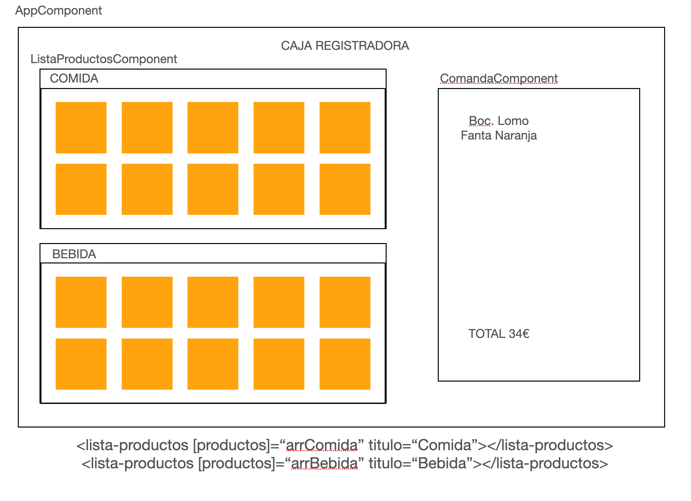

# Caja Registradora



- Instalar Bootstrap
```
npm install bootstrap
// Dentro de angular.json, en el array de styles (línea 29)
node_modules/bootstrap/dist/css/bootstrap.min.css
```

- Crear un interface
    - Producto (nombre, precio, imagen(URL))

- Crear componente ListaProductos
```
ng generate component ListaProductos --skip-tests
```

- En **AppComponent** creamos arrComida y arrBebida
```
arrComida: Producto[];
arrBebida: Producto[];

constructor(){
    this.arrComida = [
        { nombre: 'Paella', precio: 30, imagen: 'http://....' },
        { nombre: 'Cocido', precio: 12, imagen: 'http://....' }
    ]
}
```

- En **ListaProductos**
    1 - Generar los @Input() productos y titulo para poder pasarle los datos al componente

    ```
    <lista-productos [productos]=“arrComida” titulo=“Comida”></lista-productos>
    <lista-productos [productos]=“arrBebida” titulo=“Bebida”></lista-productos>
    ```

    2 - Intentamos maquetar el html de la lista, mostrando con un bucle todos los productos que recibe


## 2 RONDA

- Hay que mostrar por consola el producto que pulsamos
- Creado el Output

- En AppComponent **Definimos e inicializamos** el array productosSeleccionados
- Cuando capturemos el Output (onProductoSeleccionado), agregamos el producto al Array
- Dentro del componente Comanda generar el INPUT arrProductos

## TAREAS

- Total
- Duplicidad de productos