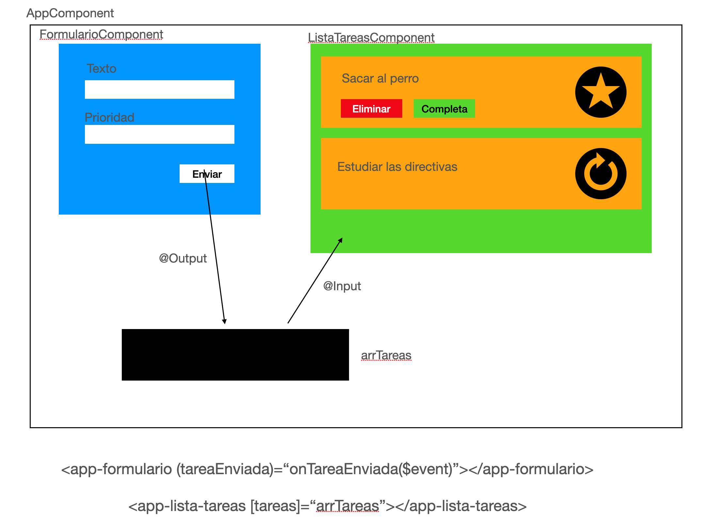

# Lista de Tareas



1 - Crear el proyecto (ListaTareas)

2 - Instalar bootstrap
```
npm install bootstrap
// En angular.json
node_modules/bootstrap/dist/css/bootstrap.min.css
```

3 - Creación del interface
    - Tarea (texto, prioridad, completa(boolean))

4 - Creación componente **Formulario**

5 - Maquetación componente formulario

6 - Importamos **ngModel**
    - Dentro de AppModule, en el array de imports, incorporamos FormsModule

7 - Enlazamos cada uno de los campos de texto con su variable correspondiente

8 - Comprobamos que al hacer click en el botón enviar vemos todos los datos de la tarea
```
nuevaTarea: Tarea;

constructor(){
    this.nuevaTarea = { 
        completa: false
    };
}
```

9 - Creación de Output para pasar la información al padre