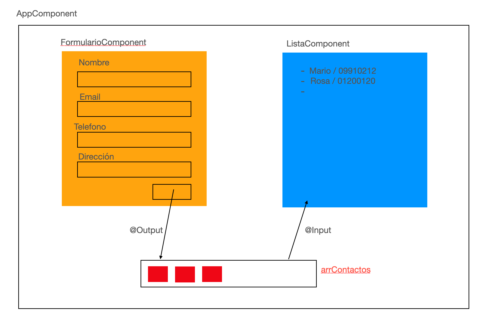

# App Contactos



- Creación del proyecto

```
ng new Contactos
```

**Responder N a todas las preguntas (menos la del CSS)**

- Creamos los componentes: Formulario y Lista
(ng generate component Formulario --skip-tests)
- Creación del interface
    - Contacto (nombre, email, telefono, direccion)

## FormularioComponent

- Maquetación del formulario
- Incorporamos **ngModel**
    - Dentro de AppModule, en el array de imports, colocamos **FormsModule**
- Crear variable para gestionar el formulario
**1 OBJETIVO**: Al pulsar el botón del formulario, me muestre la información que estoy recogiendo
```
{{ nuevoContacto | json }}
```