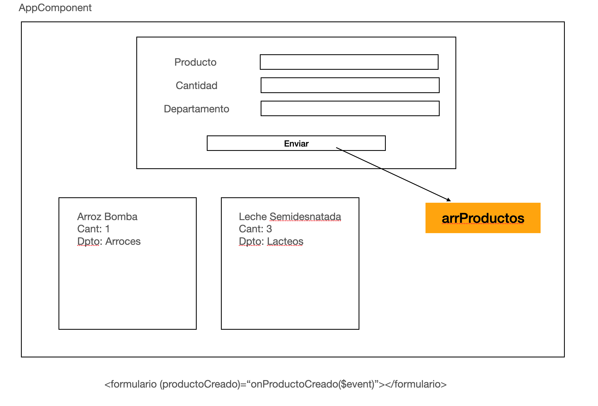

# Lista Compra



- Instalar bootstrap

- Creación de componentes: Formulario, Lista

- Creación del interfaz
    - Producto(nombre, cantidad, departamento)

- Maquetación **Formulario**

- Importamos **ngModel**
    - Incorporar FormsModule dentro de los imports de nuestro AppModule

- Recuperamos los datos de los campos de texto del formulario
    - Si hago click en el botón enviar del formulario que me muestre el producto
    - **NO SE USA \<form\>**

- Generamos el Output dentro de FormularioComponent (definición, inicialización y uso)
- Mediante el Output debemos emitir el producto creado al padre

```
<formulario (productoCreado)="onProductoCreado($event)"></formulario>
```
- Dentro del método onProductoCreado confirmar que recibimos el producto