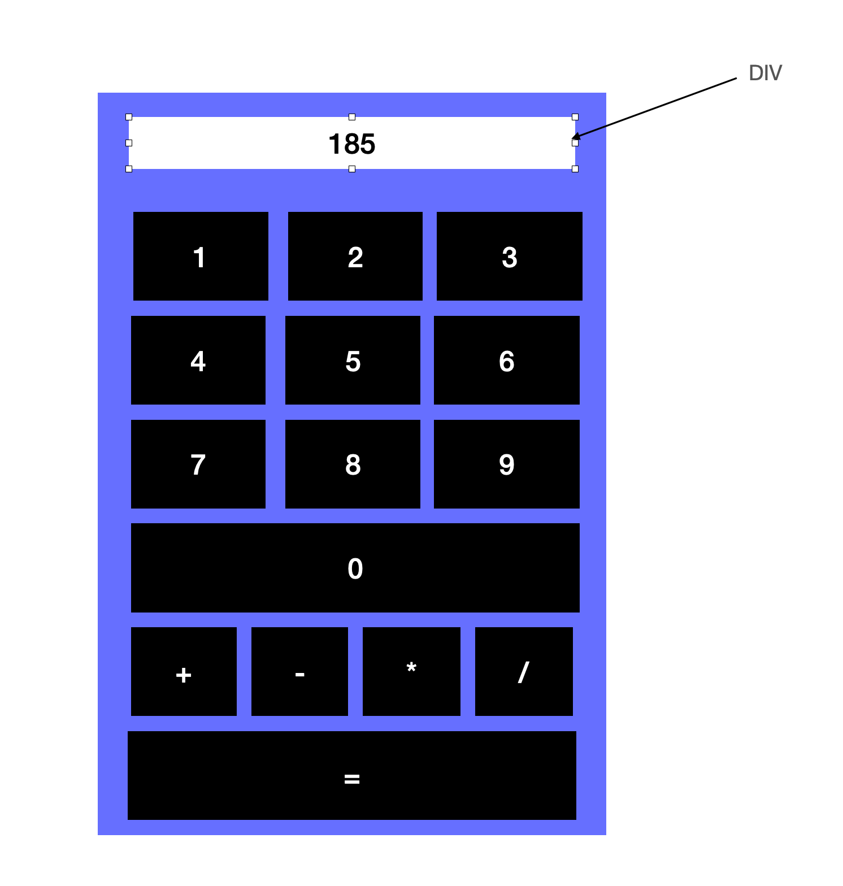

# Pasos Calculadora

- Crear componente Calculadora

```
ng generate component Calculadora --skip-tests
```

- Creación de la vista



- **Hay que incluir la calculadora dentro de AppComponent**
- Crear evento click para botones numéricos y de cálculo (+, -, /, *)
    - **TODOS LOS BOTONES LANZAN LA MISMA FUNCIÓN**
    - Probamos si el click funciona -> Comprobar si podemos mostrar por consola el botón pulsado
----

- Cómo concatenar el botón pulsado dentro del visor de la calculadora

- Exite una función **eval**